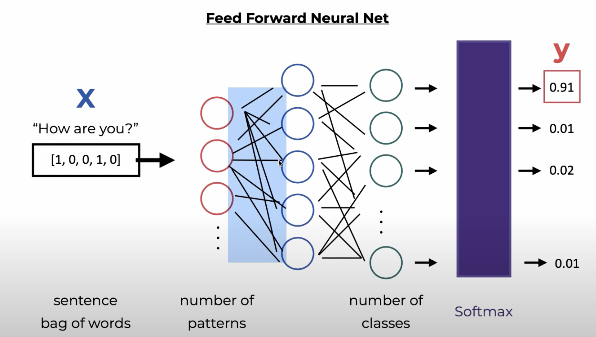

# How it works

## Definitions
- bag of words = X = input
- Red = input size for 1st layer = number of patterns
- Two hidden layers: blue and green
- Output size = number of different classes (labels) eg. "greeting" is a label
- Apply softmax to get the probability of getting each different classes (y)

## Procedure
1. The input - bag of words - goes in to the first neural layer to generate a number of patterns
2. the number of patterns becomes the input for the 1st hidden layer
3. the output of the 1st hidden layer goes into the 2nd hidden layer
4. the output of the second hidden layer is the number of different classes, which is the output size
5. Apply softmax to the output to generate the probability of getting each different classes (labels)

## Todo

1. Create training data
2. Create PyTorch model and train
3. Save/load model and implement the chatbot so we can put the trained data into chatbot's function